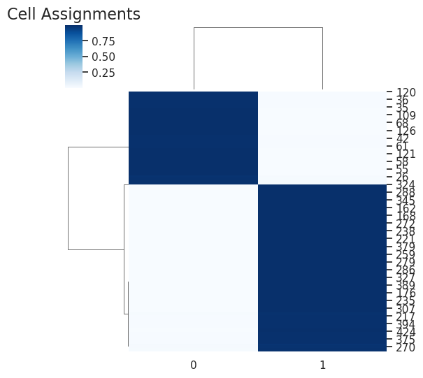
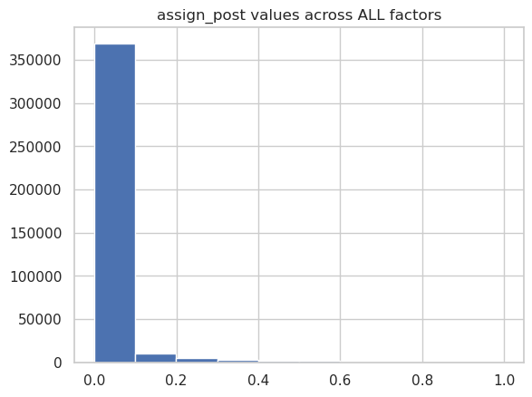
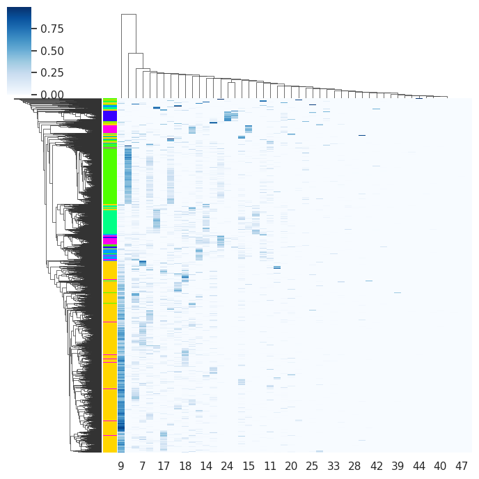
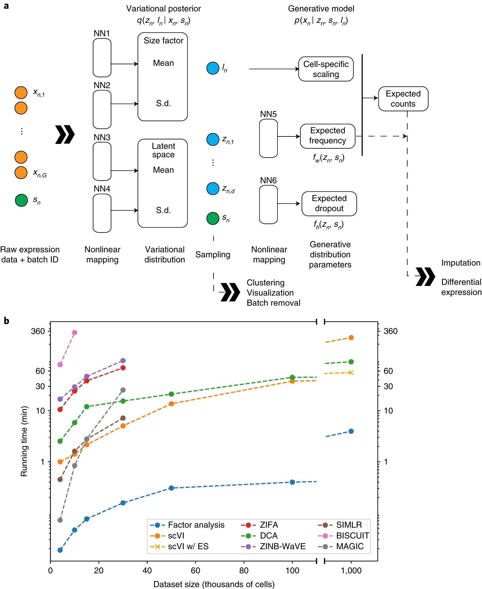

## pyro factor model notes 

#### 1. Original code (unoptimized) results for mouse brain simulations ; tabula_muris_brain/Leaflet/run_factor_pyro_model_TM_SS2_simulated.ipynb

Cell types used: Brain_Myeloid_microglial_cell and Brain_Non-Myeloid_oligodendrocyte (actually too slow on these cell types so try two other ones)   

Number of cells: 5968

Number of junctions: 4824

Number of clusters: 1608

# 

Cell types used: 'Brain_Non-Myeloid_neuron', 'Brain_Non-Myeloid_brain_pericyte'

Number of cells: 437

Number of junctions: 3762

Number of clusters: 1254

# 

#### 2. Modified code results for mouse brain simulations 

Cell types used: 'Brain_Non-Myeloid_neuron', 'Brain_Non-Myeloid_brain_pericyte'

Number of cells: 437

Number of junctions: 3762

Number of clusters: 1254

# 

#### 3. Original code (unoptimized) results for real mouse brain data

# 

#### 4. Modified code results for real mouse brain data

Cell types used: All eight 

Number of cells: 5968

Number of junctions: 4824

Number of clusters: 1608

# 

#### 5. Original code (unoptimized) results for real mouse muscle data

# 

#### 6. Modified code results for real mouse muscle data

#

## Multi-modal autoencoder via splicing and total gene expression 

- In a multi-modal autoencoder, both gene expression and splicing data are treated as input modalities, and the model learns to encode and decode each modality separately. 
- The encoder network maps each modality to a shared latent space, and the decoder network reconstructs each modality from this shared representation.
- In a traditional factor model, you may have separate factors or latent variables for each modality, and the relationship between the observed data and the latent factors can be linear or follow specific probabilistic models.

#

## scVI model 

- a, The neural networks used to compute the embedding and the distribution of gene expression. NN, neural network. fw and fh are functional representations of NN5 and NN6, respectively. 
- scVI provides a parametric distribution designed to decouple biological signal from the effects of sample-level categorical nuisance factors such as batch annotations and variation in sequencing depth.